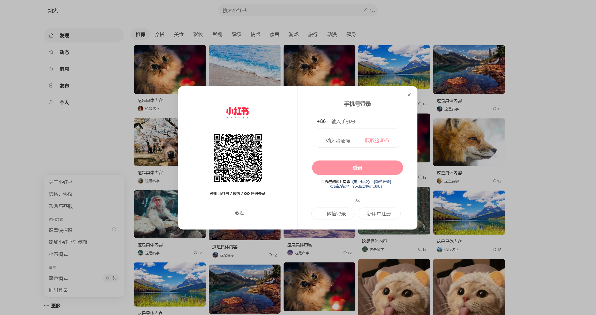
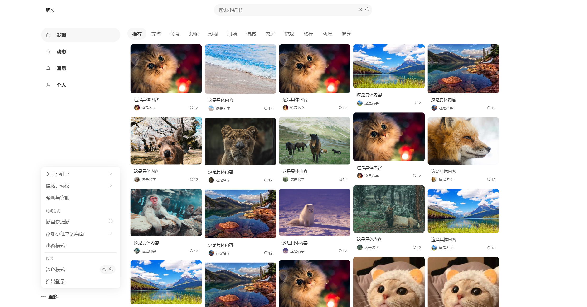
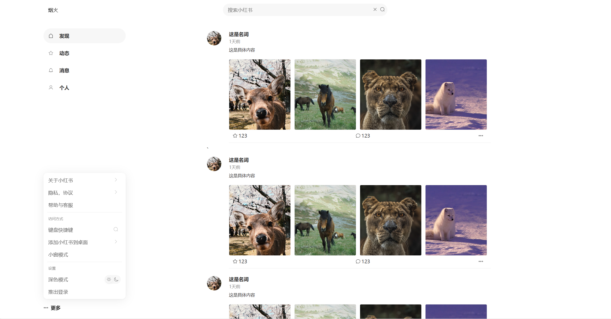
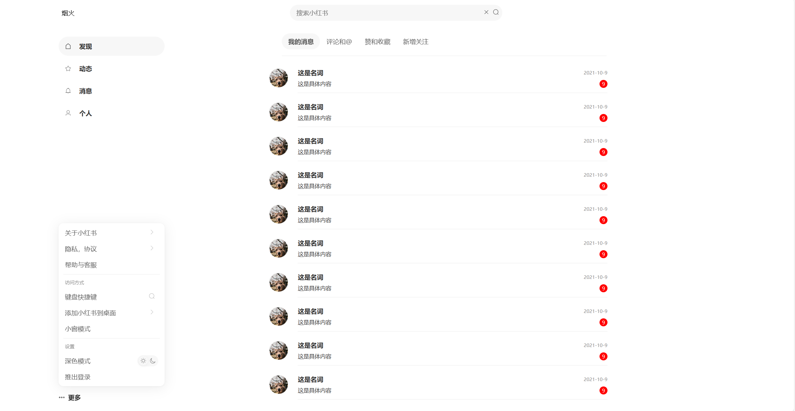
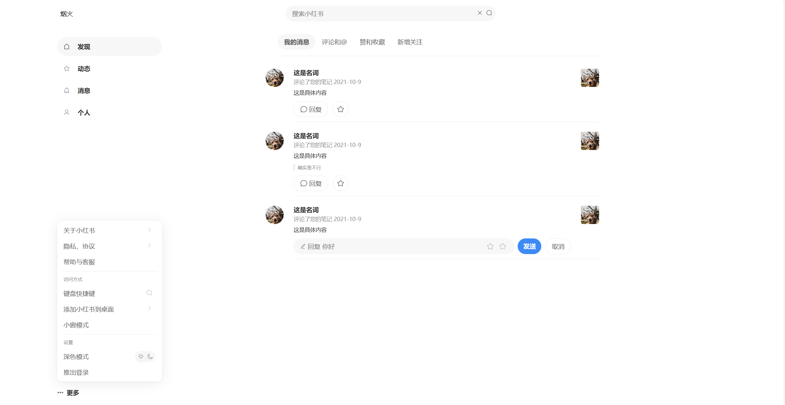
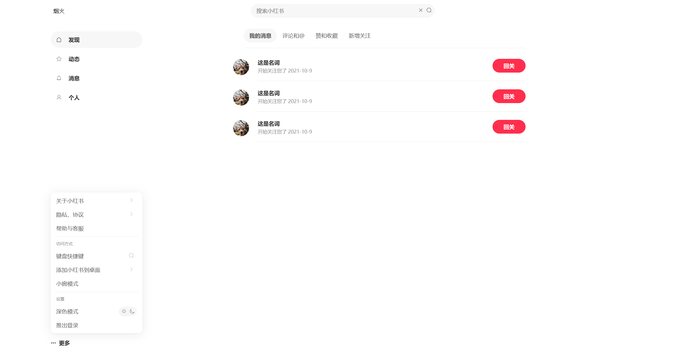

# 仿小红书web前端页面

#### 介绍
一个仿照小红书web端设计的前端项目，只需要写后端代码和会一点vue3技术即可完成全部项目，不在需要自己写样式。

#### 后端代码

https://gitee.com/xzjsccz/yanhuo_dev

这是一个完整的前后端分离项目，仿照小红书和堆糖设计的完整项目。这个小红书web端项目可以整合其中

#### 页面展示

|  |  |
| ----------------------------------------- | ----------------------------------------- |
|  |  |
|  |  |
|  |  |

